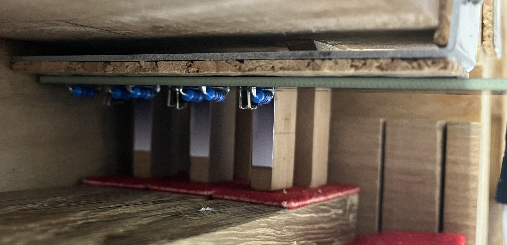

# Harpsichord Jack Tracking

This repository collects together all materials (CAD Drawings, diagrams, firmware source code) related to Harpsichord Jack Tracking Project at the NEMUS project.

|                              |
| :---------------------------------------------------------: |
| Side View of the model harpsichord used during development. |

- [Harpsichord Jack Tracking](#harpsichord-jack-tracking)
  - [Measurements](#measurements)
    - [Model Keyboard](#model-keyboard)
    - [Jack Pitch](#jack-pitch)
    - [Full Scale Keyboard](#full-scale-keyboard)
    - [Jack Pitch](#jack-pitch-1)
    - [Jack Travel](#jack-travel)
    - [PCB](#pcb)
      - [7 Sensor Face Board](#7-sensor-face-board)
    - [Gradient Tag](#gradient-tag)
    - [Diagram](#diagram)
  - [QRE1113 Notes](#qre1113-notes)
    - [Spacing](#spacing)
    - [Functionality](#functionality)
    - [Data sheets](#data-sheets)
    - [Multiplexing](#multiplexing)
      - [1. Using 2 Micro controllers](#1-using-2-micro-controllers)
  - [MIDI Specifications](#midi-specifications)
    - [Jack Differentiation](#jack-differentiation)
    - [Aftertouch](#aftertouch)

## Measurements

### Model Keyboard

###  Jack Pitch

| Jack | Centre distance from backboard (mm) |
| ---- | ----------------------------------- |
| 1    | `10.25`                             |
| 2    | `25.1`                              |
| 3    | `38.5`                              |

Gives a rough jack pitch of `14.4875 mm` with an offset of `10.25 mm`.

Pitch of the back row of jacks was determined by measuring from the open edge of the model to the front edge of the jack. Each jack had its width measured providing the values in the table below.

| Jack | Front edge dist (mm) | Width (mm) | Centre dist (mm) |
| ---- | -------------------- | ---------- | ---------------- |
| 4    | `59.85`              | `4.25`     | `61.975`         |
| 5    | `45.25`              | `4.30`     | `47.400`         |
| 6    | `31.20`              | `4.60`     | `33.500`         |

Give a rough pitch of `14.2375 mm` with an offset of  `33.5 mm` from the front edge

### Full Scale Keyboard 

|        |
| :-----------------------------: |
| Top view of the 49-key keyboard |ll

The full scale version of the interface has 49 keys and 2 jack rows. The jacks are generally around `4.65 mm`.

###  Jack Pitch

There is not much variation in the pitch of the jacks. On average the centre-to-centre is `14.02 mm`. Likely error between jacks would compound across the full length. This should be compensated for by the separate pcbs which have groups of 7 sensors.

Space between the jacks is `9.75 mm`, meaning central pcbs will have to have less than half this distance (`4.875mm`) in order to slot together.

###  Jack Travel

The jacks have a height of `91.65mm`. Front jacks have a travel of about `8.5mm` and back jacks `9.0mm` between key release and full key press.

### PCB

With a pitch of `14.02 mm` a theoretical limit to the width of a 7-sensor PCB would be `98.2 mm`, but with margin required from traces this is not possible. The upper limit is `112.22 mm` but with variation during fabrication it is unwise to push the tolerance to the nearest `1/10 mm`. A `1.5 mm` tolerance brings the limit to about `99.7 mm` to `110.7 mm`

#### 7 Sensor Face Board

Face boards mount the QRE1113s perpendicular to the board so that there is no need to bend the through hole mounting legs during assembly.

There are a couple of designs, at at present what is most important is the hole mounts at (`18.00mm`, `10.00mm`) and (`18.00mm`, `81.40mm`)

### Gradient Tag

The QRE1113 reflects from a tag with a gradient printed.

The should be `40 mm` in length to avoid potential catching on the jack hole. The active area of the gradient need only be the length of the [jack travel](#jack-travel)

### Diagram

|                 |
| :-----------------------------------------------: |
| Cross-section of full sized harpsichord interface |

## QRE1113 Notes

|              |
| :---------------------------------------------------------: |
| Model keyboard and QRE1113s attached to Arduino Nano 33 IoT |

Displacement of the jacks is measure using QRE1113 IR LED / Transistor pair. The section covers some general observations and helpful information about these sensors.

### Spacing

Distance between pins is `1.8mm` meaning the space from the centre is `0.9mm`. CAD placement should offset by `0.9mm` to compensate.

|                 |         |
| --------------- | ------- |
| short leg pitch | `1.80mm` |
| long leg pitch  | `3.80mm` |

### Functionality

QRE1113s are used with alongside adhesive strips with a black and white gradient printed on it, which are attached to each jack. 

The optimal distance between the strip and the sensor is around 6mm with a voltage reference of [`1.65V` provided by Arduino SAMD boards](https://www.arduino.cc/reference/en/language/functions/analog-io/analogreference/)

|  |
| :-----------------------------------------: |
|     Jacks with gradient strip attached      |

### Data sheets

- [QRE1113 Datasheet](https://www.mouser.in/datasheet/2/308/QRE1113-1121523.pdf)

|  |  |
| :----------------------------------------------------------------------------------------------------------------------------------------: | :----------------------------------------------------------------------------------------------------------------------------------------: |
|                     QRE1113 Dimension. Not that pin 1 should always have a chamfer on the corner to help identify it.                      |                                                               QRE1113 Pinout                                                               |

### Multiplexing

- 14 Boards
- 7 sensors each
- 7 analog channels
- 8 channel multiplexer

- BLE Nano
  - 8 ADC channels A0 - A7
  - For 8 ADC channels an 8-channel multiplexer will allow for 8 boards to address 8 sensors.

Solutions:

1. Use 2 micro controllers, one for front, one for back
  - each a separate MIDI device
2. cascade front and back
  1. two groups of transistors
      - 16 transistors
        - 2 sets of 7 for signals
        - 2 extra for interfacing with the others
      - 2 extra digital pins used
  2. another bank of multiplexers
      - 7 multiplexers for groups of seven boards
      - 3 more digital pins for control 

#### 1. Using 2 Micro controllers

- Each sensor board needs 8 pins
  
  1. GND 
  2. VCC/VDD 5V
  3. VDD 3V
  4. Mux Address A
  5. Mux Address B
  6. Mux Address C
  7. LED Data
  8.  Signal 1
  9.  Signal 2
  10. Signal 3
  11. Signal 4
  12. Signal 5
  13. Signal 6
  14. Signal 7

## MIDI Specifications

Below are additional MIDI specifications retrieve the most information from the controller. 

Currently this is being written and subject to change

### Jack Differentiation

There is one channel per key as per [Standard MPE specifications](https://midi.org/mpe-midi-polyphonic-expression#:~:text=The%20MPE%20specification%20defines%20a,products%2C%20using%20MIDI%201.0%20messages.).

There are two note ons with associated velocities and note offs

A `note on` message `channel`, `pitch value`, `velocity`.

Velocity demarcates wether the note on message is related to the first jack or the second jack.

Given the signal obtained from the jack tracking does not provide the resolution in velocity to utilize the full 7 bit set of velocity values.

The First jack uses the velocity values from `0` to `63` and the second jack from `64` to `127`.

Note off messages use the same specification.

Therefore the physical model can relate the note off message to it's respective note on message.

example:

|            | Jack1 | Jack2  |
| ---------- | ----- | ------ |
| `channel`  | 1     | 1      |
| `pitch`    | 56    | 56     |
| `velocity` | 0-63  | 64-127 |

**NOTE:** There is a secondary use case where the controller is used with a digital instrument that expects a standard MPE signal. In that case there _may_ be problem. However, it is not guaranteed to not work. Behavior in this case is undefined.

The same is true of the plug-in, which will be written to expect the above format of note messages.
As a result, the plug-in will need two modes of operation. A standard MPE for using with a standard MPE keyboard requiring a single note on/note off per key. The second mode designed specifically for the harpsichord keyboard interface. This gives control of the excitation of both of the strings.

### Aftertouch

Channel Pressure (MIDI Status event nybble `0xD`) is sent as one stream, taken from the front jack tracking signal.

